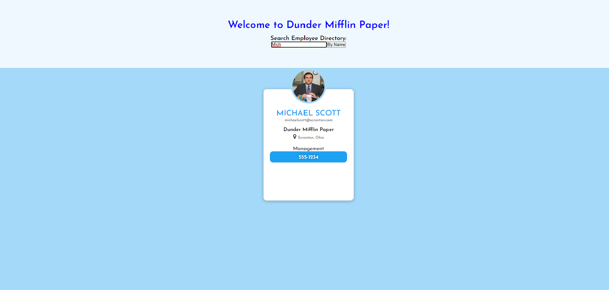

# Reactive Directory

## Table of Contents
> - [Description](#Description)
> - [Keywords](#Keywords)
> - [Contributors](#Contributors)
> - [Usage](#Usage)
> - [Installation](#Installation)
> - [Test](#Testing)
> - [License](#License)
> - [Deployment](#Deployment)
> - [Questions](#Questions)

## Description
>Employee Search Directory with React FrontEnd

## Keywords
>*React, NodeJS, SCSS*

## Contributors
>Liam Mackinnon

## Usage 
>npm start

## Installation
>*npm i*

## Testing
>

## License
>Unlicense

## Deployment
https://liam-mack.github.io/Reactive-Employees/ 

Screenshot?: Yes

### Questions
>If you have any further questions about the application:
>Email: lmackinnon.inbox@gmail.com
>
>GitHub: www.github.com/liam-mack
